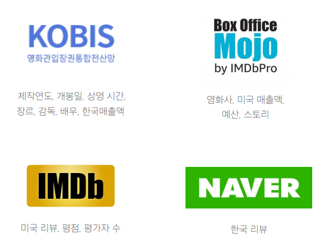
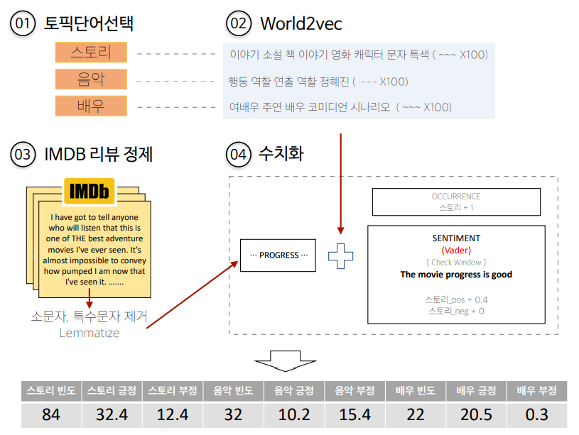
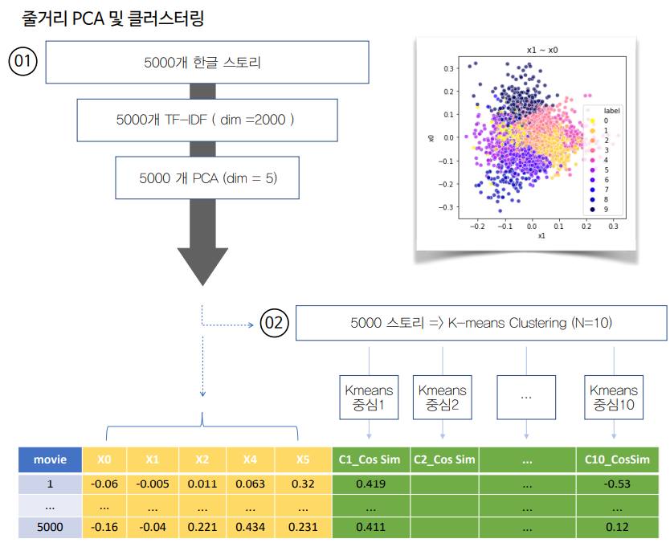
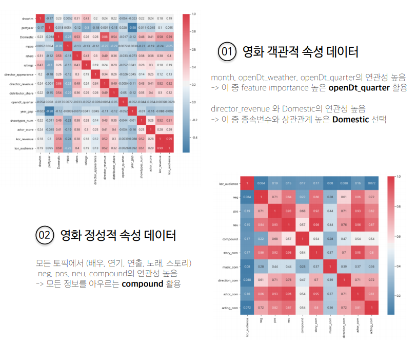
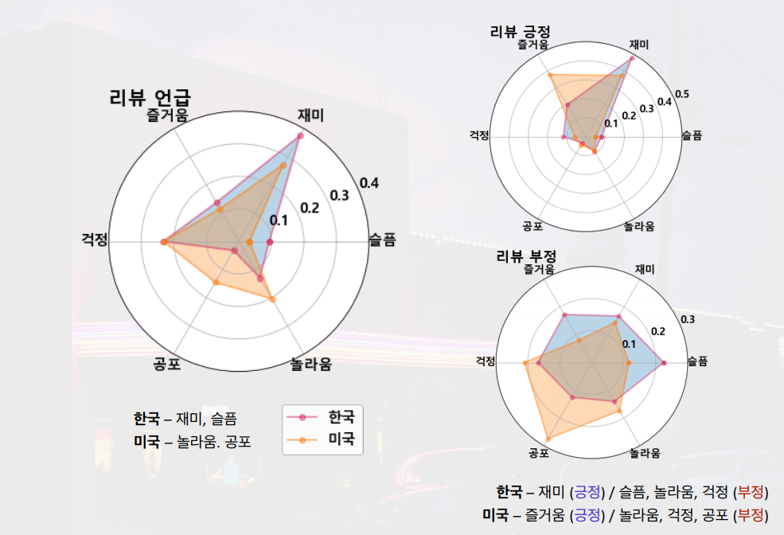

# Analysis-of-foreign-film-income-profits

> 한국데이터산업진흥원의 빅데이터 청년인재 프로젝트

> [발표영상](https://www.youtube.com/watch?v=9_UFrXmfsuA)

## 🌱 Team Members 

 

세상에는 많은 영화가 있고 영화 수입사들은 외국의 영화를 수입해서 상영합니다. 

영화를 평가하는 기준 및 수익성은 나라마다 다르기 때문에 저희는 각 나라의 리뷰를 통해서 차이를 극복하고 

**머신러닝** 모델로 **수익성**을 예측하고자 합니다. 

---

## 🌱 Crawled data

영화에 대한 외국의 평가와 우리나라의 평가를 모두 모아야 하기 때문에, 4가지 사이트에서 데이터를 크롤링 하였습니다. 

[데이터는 여기서 받을 수 있습니다. ](https://drive.google.com/drive/folders/1ns7454PyNady1-GnF8vdZAt8rlovfbuZ?usp=sharing)

---

## 🌱 Review to numerical data

주어진 리뷰에 대해서 사용자는 토픽 단어를 선택하여 해당 리뷰를 토픽에 맞춰서 수치화 할 수 있습니다. 

## 🌱 Story clustering

영화 줄거리에 대한 정보를 예측에 추가하기 위해서 PCA를 진행하였습니다. 

## 🌱 Data Analysis

## 🌱 Sentimental Analysis by Country

미국과 한국에 대한 리뷰 반응의 차이를 분석해보면 영화에서 무엇을 중요하게 생각하는지 알 수 있습니다. 

---